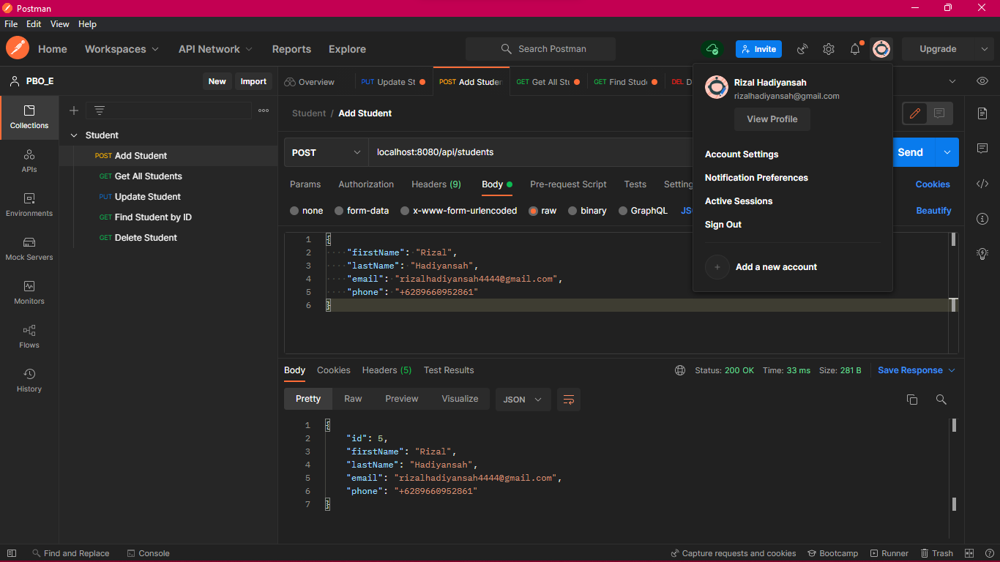
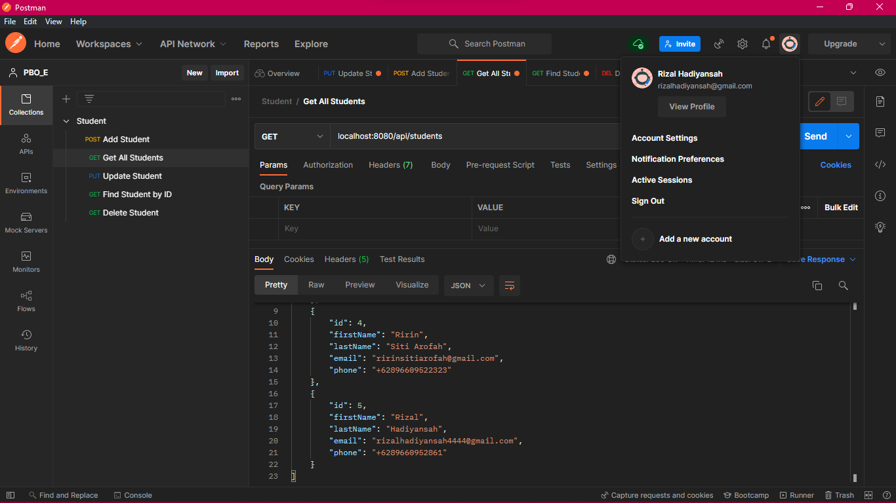
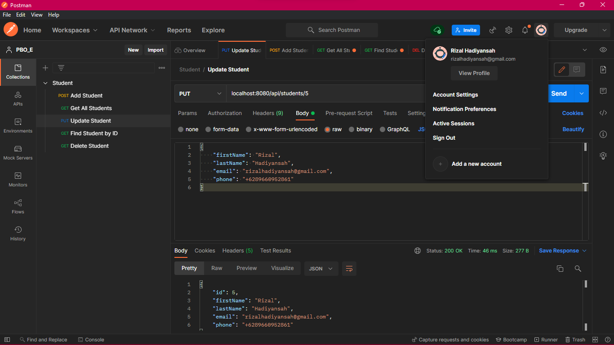
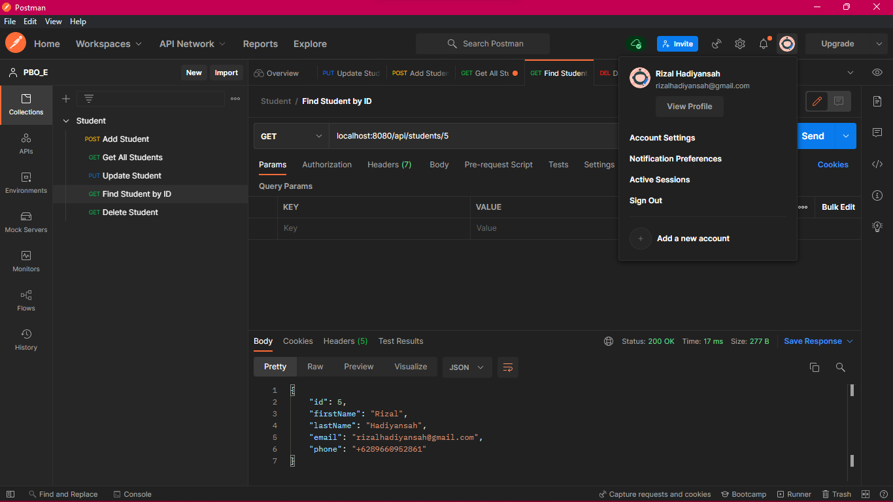
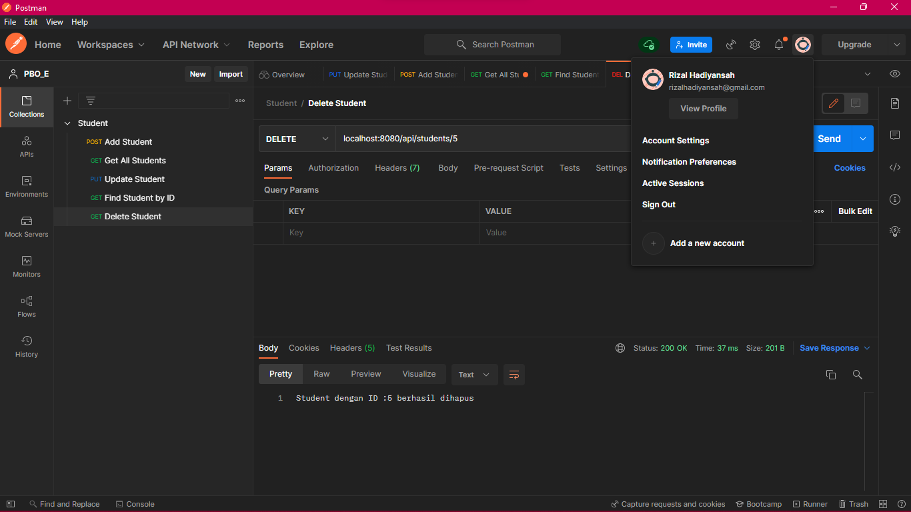
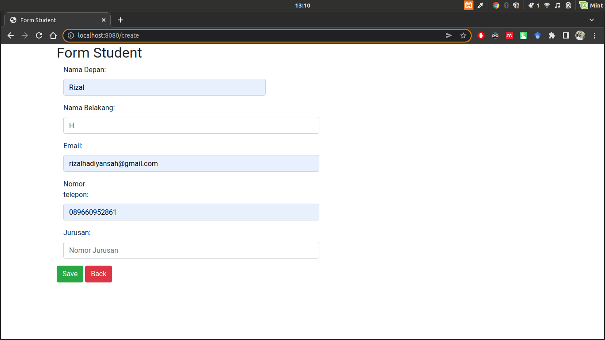
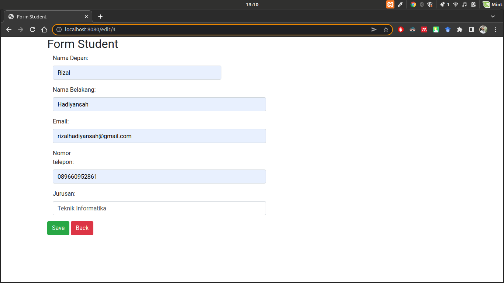
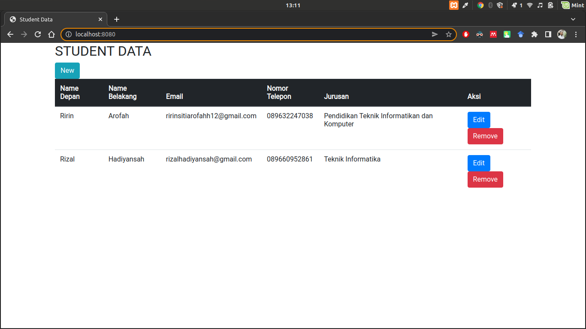

# Student CRUD App

Aplikasi Spring Boot yang dibuat untuk memenuhi tugas CRUD pada mata kuliah PBO.

## Screenshot API

### Add Student

### Get All Students

### Update Student

### Update Student

### Find Student by ID

### Delete Student

## Screenshot Web

### Add Student

### Edit Student

### Data Student

